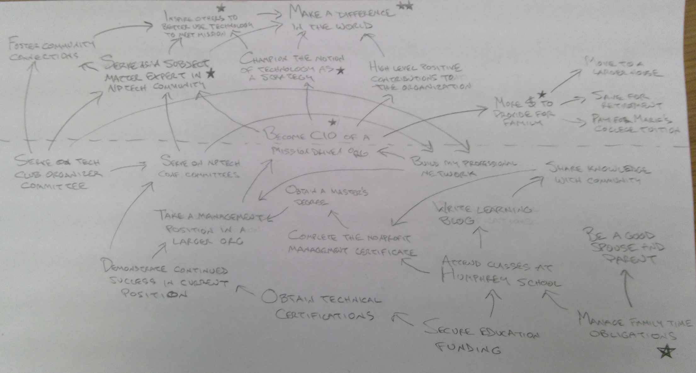

This was a pretty difficult week. Similar to week five there were multiple assignments due and it was a challenge to squeeze the work in to the time I had available. This time I planned the workload a little better, stayed calm, and felt like I was in control of the challenge the entire time.

>Table of contents
> * [Notes from Strategic Planning](#notes-from-strategic-planning)
> * [Notes from Strategic Human Resources Management](#notes-from-strategic-human-resources-management)

That's not to say it was easy. It was in fact a ton of work, and I ended up spending most of the last nice weekend of the season inside studying. Sunday and Monday were very late nights finishing up assignment drafts. And for the first time this semester I walked in to a class (SHRM) without having done the reading. And there wasn't much reading to do, which was why when I felt too tired on Tuesday night that I could just do it over lunch or between work and class on Wednesday, only to have those times crunched by other things.

I felt a bit guilty for not having done that reading, and did catch it up after class. To be completely honest, I might not have gone back and done that if not for wanting to continue my streak of posting summaries of all the required readings on this blog. And after I did that I was glad I did. The material was valuable and illuminated the class discussion, and the process of summarizing it really does help me re-process and understand the concepts better. (While of course also providing a pre-written list of points to pull in to an assignment outline later.)

Something which has concerned me a bit is how I'm balancing my performance at work with school and everything else. They've been great about letting me take some PTO when I really need a little extra time for school, including this past Tuesday when a took the afternoon off to finish homework and then get a nap in before class. I ended up taking another PTO day on Friday when I woke up to find out that our furnace wasn't working with low temperatures in the 20s forecast this weekend. My time off situation is a bit dicey since I just took this job in February and don't accrued much yet. Beyond that I feel like I'm not quite performing up to my usual standards, which to be fair is probably to say I'm used to overachieving and not doing that right now. I am meeting expectations, doing everything asked of me, and keeping my big database implementation project on track. But I feel like I'm not doing as much as I could in terms of looking ahead at future projects and using spare time to take initiative to start laying groundwork on those. I've found it difficult to self-motivate to that end when I'm exhausted and pre-occupied by school, and I've been feeling a bit guilty about that and trying to do a little better in that regard.

I have started finding ways to leverage schoolwork to make a contribution in the workplace - I wrote this past week's SHRM pro-con performance appraisal analysis memo based on our real-world process and submitted that set of recommendations to management, and this coming week I hope to use a mapping process from SP in a meeting about a new initiative. Ultimately I'm grateful for the job I have and for the flexibility they're granting me to pursue higher education. I'm convinced that I couldn't have done this at my previous job, not because of flexibility but because my workload was so over-the-top there. And after years of being overloaded it feels strange to be in a job where my workload is manageable. I've joked with a few people that of course I had to take on school on top of work now because can I ever not be a glutton for punishment? But really, it is an adjustment taking home a paycheck and not taking home work most nights. So I'm trying to be mindful that school doesn't lead to slacking and taking advantage of my employer. My hope right now is that I can perform up to standards working a normal amount while increasing my capacity to make positive contributions by growing competencies through education.

On a very different topic, something else that I noticed this week was that the camaraderie in both classes has really seemed to gel. At the end of the SP class this week I noticed that nearly everyone stuck around for about five or ten minutes having various conversations around the room. It was a subtle but distinct change from earlier in the semester, as everyone is clearly becoming more familiar with and engaging with each other. A similar change has taken place in SHRM, where the classes are primarily structured as round-robin discussions, and in the past couple of weeks especially it has seemed like the group has just found a nice groove. Our discussions flow well, and they feel more natural and fun than when the semester was brand new. At least, it feels that way for me.

With another spate of assignments down, the coming week is again throttled back in terms of difficulty. Aside from a heavy reading load for Bryson's class, there's a little more room to breathe. So far I've been spending that catching up on these blog posts covering last week (and dealing with the temporary lack of heat / getting our furnace fixed). But as I write this around 5pm Saturday, I'm thinking about the group projects in each class, neither of which has immediately pressing work but both of which could definitely benefit from putting some work into sooner than later. Am going to do my best to make a dent there before class next week.

Regarding what was covered in class this week, in Strategic Planning we participated in a visual strategy mapping exercise, while in Strategic Human Resources Management we had a lively discussion about compensation.

## Notes from Strategic Planning

This week's SP class

* Gener Dodaro, Comptroller General of US & head of the GAO, on traits he looks for in hiring:
  * Critical thinking skills
  * ability to learn quickly
  * assess large volumes of information
  * ability to work in interdisciplinary teams
  * knowledge of how to create positive change
* US Coast Guard strategic plan is organized around a set of principles, which point to competencies. An ability to create a clear objective. Which is not easy.
* Some of the USCG principles:
  * Ability to have an effective presence when they’re needed
  * Ability to work well with the other and create unity of effort
  * Ability to manage risk
  * Ability to be flexible
  * Ability to be restrained
* **Linking aspirations with capabilities allows you to create stakeholder value**
* Most strategic plans are silent on competencies and distinctive competencies
* Competencies are intangible, embedded in networks, often not recognized. Danger of not recognizing competencies - can lead to trouble when downsizing or outsourcing.
* Think about a livelihood scheme as the core logic behind a strategic plan. Strategies and actions can come and go, but if you have a relatively stable and virtuous set of aspirations, and the competencies to achieve those aspirations, then you can survive a lot of things.
* Mapping comes into play because it helps make sense of complicated scenarios.
* Average adult can only handle 5 to 9 issues in short term consciousness at any one time. So you need some sort of external memory to help keep it all straight.
* The activity we’re going to be doing is action-oriented (also called visual) strategy mapping
  * Typically, always start with a verb. Every statement you make is an action
  * Every statement 6 to 8 words
  * One idea per statement
  * Don’t use _or_ or _and_
  * Don’t use words which should be arrows
  * First question - _what do you want to do?_
  * Second question - _how do you want to do that?_
  * On a sheet of legal size paper turned to landscape, draw a dashed line across the page one-third of the way down
  * Write the thing that you want to do in the middle of that line
  * Then, below the line, start writing things that need to be done in order to do that. And things that need to be done in order to do those things. Draw arrows denoting relationships (do this ----> to get here). There should be chains of actions at least four arrows long.
  * Above the line, start writing impacts of the thing you want to do. Draw arrows up to denote what you'll be able to achieve by accomplishing that.
  * At the end, mark:
    * Two stars next to the one item which is the single most important outcome (this is your true reason for pursuing the goal)
    * One star next to each of the next five most important outcomes
    * A different looking star next to the most important place to start (what needs to be done first to make the rest of this possible)

* **Mapping is what we do for when thinking matters**
* The technologies of helping with thinking are really cheap - post-it notes, flip charts, markers, pencils, etc. Compared to the costs of not thinking things through, the benefit-cost advantage is enormous.
* Anecdote from Bryson about how he carries some of these materials in his briefcase, and will pull them out in meetings and just start sticking them up on the wall
* The norm for too many meetings is that a brave soul comes up with an idea and we beat it to death for 45 minutes. Then another brave soul has another idea and we beat that to death for 45 minutes. In the end we’ve spent 90 minutes and have two dead ideas.
* Mapping software suggested by Bryson - [Banxia Decision Explorer](http://banxia.com/dexplore/)
* Strategic issues are big deals, they arise on the organization’s boundaries with its environment.
* The strategy will articulate the connection.
* Things to think about and remember:
  1. The issue should be phrased as a question that the organization can do something about
  2. The question should have more than one answer
* The most common way of identifying issues is through regular conversation. Most often the ideas that people put out there are strategies or solutions. The challenge as a facilitator is to hold the conversation open long enough to get a multitude of ideas out. Then work backwards, what is the issue to which they are answers? Frame the discussion in a way that all of them could be possible answers.
* By starting by asking people what do you want to do, then ladder up into the goal system, people can imagine what they want to do. It leads up to an examination of mission, and in many cases the process results in a pretty significant tweak to the mission of the organization.

## Notes from Strategic Human Resources Management

* Tonight’s question: how much does money motivate people, and how much of it relates to money?
* Impacts on motivation:
  * Your boss
    * So important that you have a boss with similar concepts of motivation, and who you enjoy working for
    * Characteristics of the organization
    * Characteristics of the work itself
  * Context
    * Individual vs. team
    * Kind of support you get
  * Kinds of rewards
    * Opportunities for training
    * Recognition
    * Leadership attention
* Purpose motivation (Pink, 2010)
  * Autonomy
  * Mastery
  * Making a contribution
* Herzberg’s intrinsic factors: **Nature of work itself matters most to motivation**
* Job design that promotes motivation
  * Skill variety - anecdote of Ford Motor factory, productivity went up when people were given the opportunity to diversify their tasks
  * Task identity (mastery)
  * Task significance (making a contribution)
  * Autonomy (discretion and control)
  * Feedback
* Expectancy theory
  * **If you don’t train people so that they feel like they’re capable of doing the job, they won’t be happy**
  * Rewards can be more than cash compensation, could be recognition, leadership attention, etc.
* Bonus systems haven’t been shown to work in the public sector. It’s easier in the private sector where there is profit, growth, etc. that are good measures of performance and can be used to provide rewards.
* Wiley (2012): R-E-S-P-E-C-T
  1. Respect
  1. Exciting Work
  1. Security of Employment
  1. Pay
  1. Education and Career Growth
  1. Conditions
  1. Truth
* Burnout - there’s a tipping point where you get overstimulated
* **You need a certain amount of tension to get motivated and drive performance, but too much stress and pressure and burnout leads to decreased performance**
* Problem with tenure - often in government and civil service positions, promotions and pay are primarily based on tenure. Does not reward performance, innovation, etc.
* What is the purpose of compensation?
  * To be attractive to talented people
  * To reward people for the work they do
* How does a strategic human resource system administer compensation?
* Pay ranges are traditional system, pay bands have collapsed ranges into a number of bands where the hiring manager has more autonomy to place people in a different band
* Compensation approaches
  * Skills-based (often defined as how many degrees you have)
  * Pay for knowledge (certifications, software competencies)
  * Longevity or steps
  * Merit or pay for performance
  * Gain-sharing
  * Team-based
  * Arbitrary
* Opinion - **the worst kind of compensation is arbitrary. Never a good situation when your pay is dependent on satisfying the whims of your boss. Can really do harm to an organization.**
* Problem with tying compensation increases to performance appraisals is that some managers will game the system and inflate ratings to get employees more money.
* Risher (2002): If there is a common answer.. **Salary system is only one component of an integrated people strategy, but it is the lodestone that attracts the attention.**
* Recommendations (Pfeffer 1998)
  * Collective compensation
  * Use compensation to support culture
  * Make compensation practices open
  * Use other means beside compensation to motivate
* “It is the job of leaders to have both the judgement and the courage necessary to break with common practice.”
