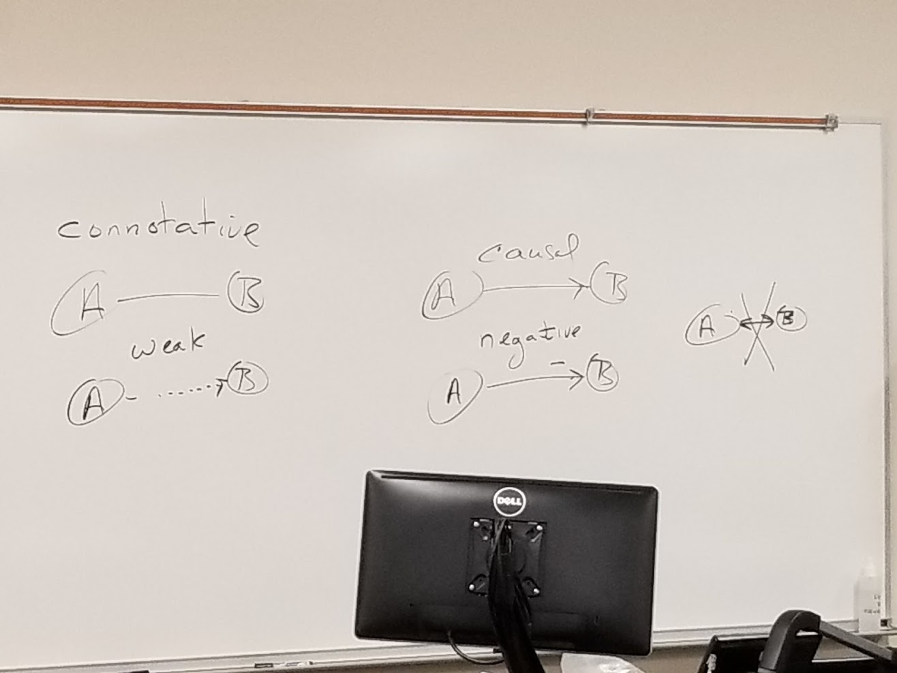
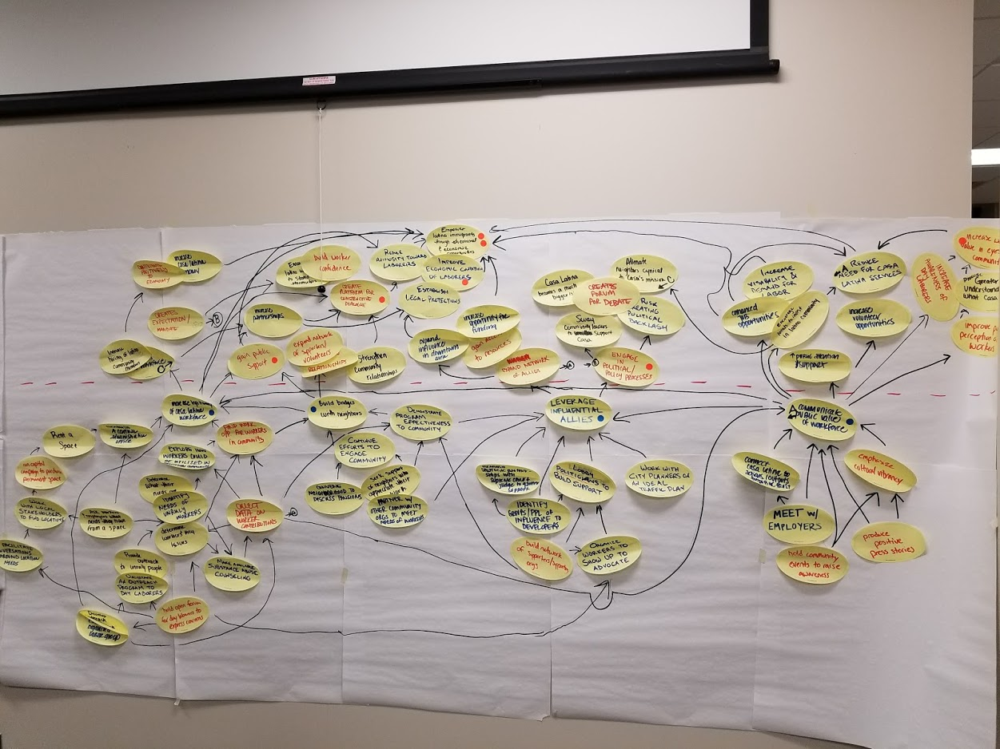

I'm not sure what to write about this week.

>Table of contents
> * [Notes from Strategic Planning](#notes-from-strategic-planning)
> * [Notes from Strategic Human Resources Management](#notes-from-strategic-human-resources-management)

The temperature has dropped and it feels like winter has arrived. Household chores are behind schedule due to the demands of school and work, we need to get window plastic up to insulate better. In the meantime the cold nights have lent themselves well to deep sleeps and family snuggles. I'll hopefully find some time this weekend to take care of that and (a little belatedly) put the hydrangeas and rose bushes to bed, but that also needs to get balanced out with the somewhat heavy school workload for this coming week. Things have also picked up at work and I'm entering a critical phase of our big database deployment project there. It feels like things are getting busy on all fronts all at once, and the next few weeks are going to be a hectic sprint to the end of the semester.

## Notes from Strategic Planning

This week's strategic planning class was entirely devoted to a strategy mapping exercise. Flip charts were arranged five across by two high, with a horizontal dashed line drawn about 1/3 of the way down from the top.

The class was split into groups of four or five. Everyone was tasked with writing out at least eight actions on oval post-it notes. The notes were then put up on the flip charts, grouped under a heading - the most abstract idea of the group or a new heading is posted at the top of the grouping. Then arrows are drawn in pencil denoting causal relationships between them. The items and arrows ladder up from concrete ideas to the strategy heading the group.

The second part was for each group member to write consequences (good and bad) on the post-it notes and place them in the top zone on the flip chart. Those are then grouped and arrows drawn - both between corresponding consequences and to denote which strategies ladder up to them. An overarching consequence is posted at the top of the map. Two dots are placed on the one or two post-its that represent the mission. Another dot is placed on up to five post-it notes that represent the goals. Finally, draw over the pencil mark arrows with black marker to make them more visible.

* The map flows upward from actions --> strategies --> goals --> mission
* Oval shaped post-it notes are used because people have a natural tendency to arrange rectangle shaped notes in rows and columns
* Strategy maps visualize the logic of a strategic plan
* The exercise was completed in just about two hours. In a real-world scenario there would be a trained facilitator at each map, start with dinner and drinks the night before (because alcohol dissolves the superego), do a half-day of mapping, lunch, then review and wrap up afterward
* Quote overheard after class - “you’ve been a strategic thinker your whole life. This class is taking that to a higher level”

## Notes from Strategic Human Resources Management

This week's SHRM class featured a guest speaker on the subject of labor relations. I'm not going to summarize their points here, but a key takeaway was that there are two types of labor negotiators - one type who’s hard nosed, adversarial, and withholds information; and a type who sees labor negotiation as a process and acts collaboratively with the other side. Our guest speaker spoke to understanding labor movement issues in a way that demonstrated genuine concern and desire for collaboration.

Notes from Prof Jay's lecture:

* State of MN has Bureau of Mediation Services - they assign a mediator for a situation that’s at an impasse.
* We don’t see very many strikes. Part of that is a modifying effect - the unions know they can’t get outrageous amounts, and the employer understands they need to be reasonable because they need the labor force.
* Successful labor relations program - objective contributors (Schumacher, 2002)
  * Principles
  * Strategic Plan
  * Management Team
  * Communications
  * Organizational Position
  * Configuration of Bargaining Units
  * Access to Senior Management
  * Clear Contract Language
* Best practices for reinventing labor relations:
  * Employee training
  * Managers as coaches
  * Employees positive
  * Measurement tools
  * Collaboration - notion of work teams
  * Incorporate technology - faster communication
  * Teach employees problem-solving skills
  * Compensation for skill building
  * Common management/employee goals
  * Innovation through labor/management committee
* Unions can bring on management problems sometimes, stuck in a power dynamic.
* Managers shouldn’t be in it because they want control, should be in it because they want to make things work. Reflection of that in union approach as well.
